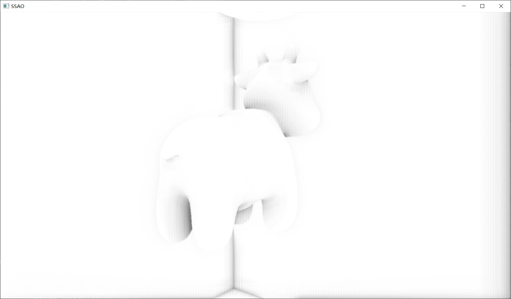
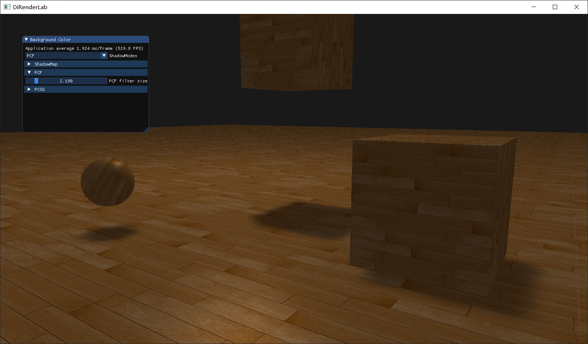
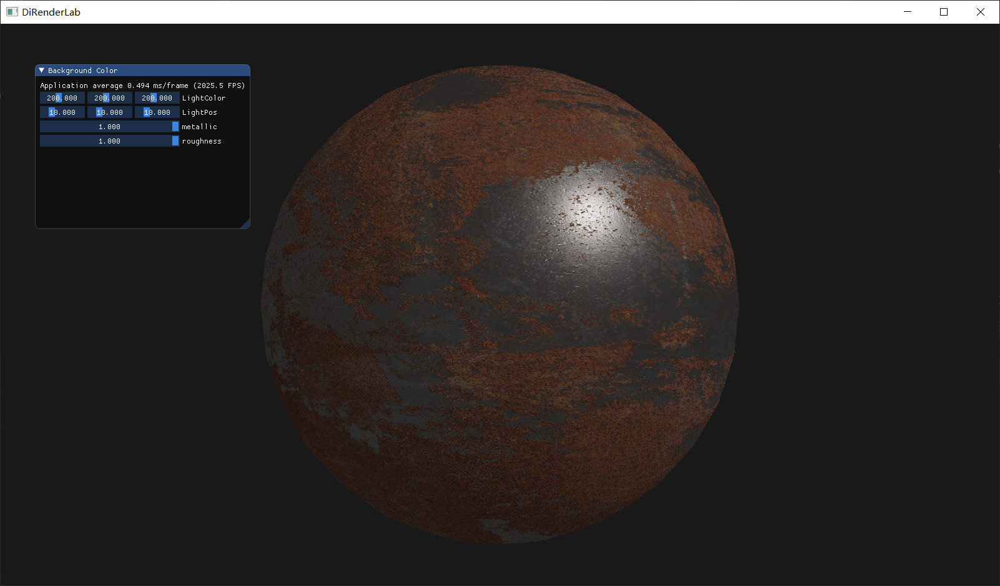
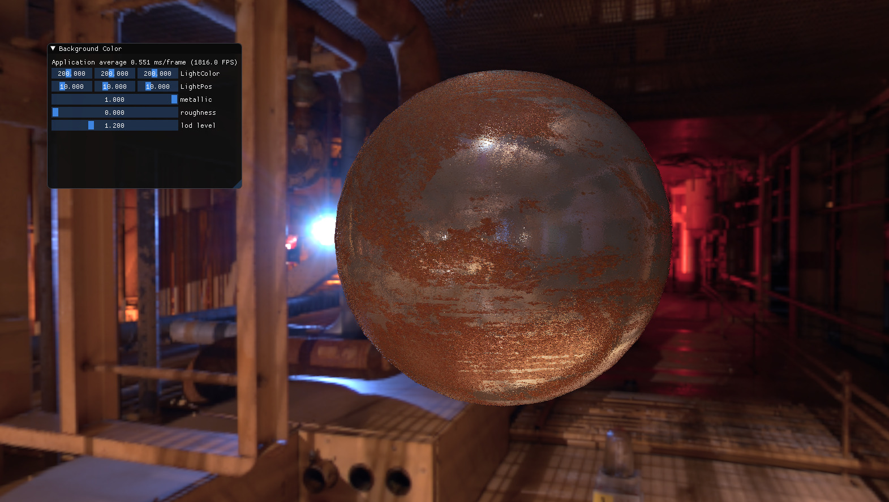
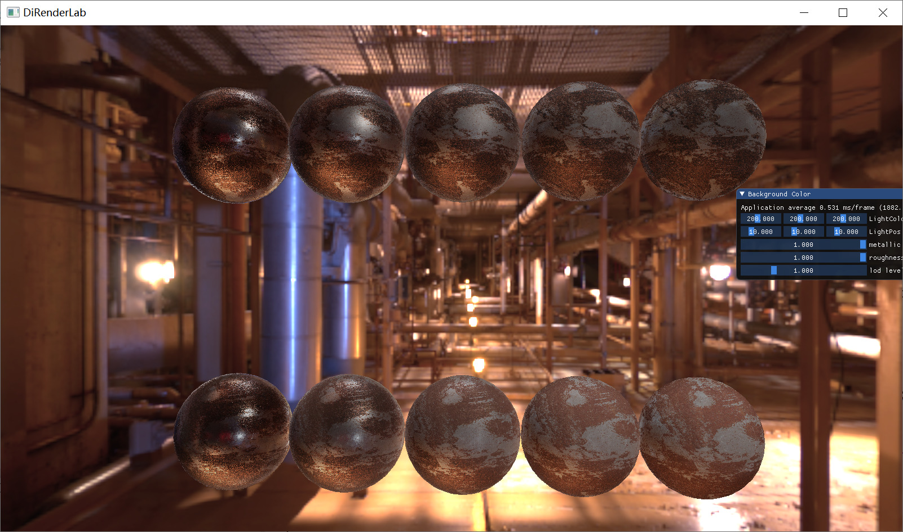
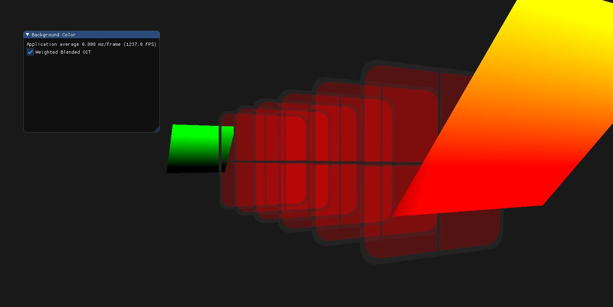

# DiRenderLab

Windows MSVC2019 & Ubuntu latest:

A lab for real-time rendering based on OpenGL4.5 with DSA.

The Framework is originally based on LearnOpenGL.com. Some code and resources are from LearnOpenGL.com.

# Compile & run

- OpenGL 4.5+ and ARB_bindless_texture are needed.
 
  **Known issue**: Intel GPU may **NOT** support the bindless extension.
- Mainly developed and tested on Nvidia GTX1050TI. Some code are also tested on AMD GPU.
- Compile: go for [build.yaml](.github/workflows/build.yml) for details.

# Milestones

- SSAO
  

- Shadows(ShadowMap,PCF,PCSS)
  

- PBR(No IBL)
  

- PBR(IBL)

  note: Code, especially the shader code, is copied from [LearnOpenGL](https://learnopengl.com/PBR/IBL/Specular-IBL).

  
  
- PBR(Kulla-conty)
 work from [siggraph](https://fpsunflower.github.io/ckulla/data/s2017_pbs_imageworks_slides_v2.pdf)
 I believe there is subtle bug in the implementation but the renderdoc fails to work with the OpenGL 4.5.
 Someday I will revisit the implementation with DirectX12 so that I can figure out what's wrong with the code.
 
 With high roughness there is noticeable enegy loss with Cook-Torrance BRDF. The Kulla-conty method is to precompute the loss energy
 and compensate it with an additional BRDF lobe.
 
 The second row is with kulla-conty and the last sphere with high roughness value is slightly bright than the first row.
 I believe it is too bright than I expected but anyway it works. Maybe some minor mistakes are in shader code.
 
  

- Weighted Blended OIT

  note: Code, especially the shader code, is copied from [LearnOpenGL](https://learnopengl.com)

  

