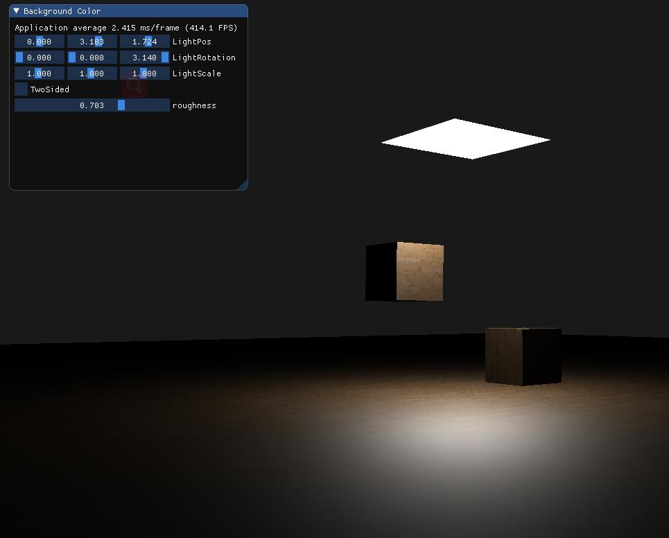

# DiRenderLab

Windows MSVC2019 & Ubuntu latest:

A lab for real-time rendering based on OpenGL4.5 with DSA.

The Framework is originally based on LearnOpenGL.com. Some code and resources are from LearnOpenGL.com.

# Compile & run

- OpenGL 4.5+ and ARB_bindless_texture are needed.
 
  **Known issue**: Intel GPU may **NOT** support the bindless extension.
- Mainly developed and tested on Nvidia GTX1050TI. Some code are also tested on AMD GPU.
- Compile: go for [build.yaml](.github/workflows/build.yml) for details.

# Milestones

- SSAO
  

- Shadows(ShadowMap,PCF,PCSS)
  

- PBR(No IBL)
  

- PBR(IBL)

  note: Code, especially the shader code, is copied from [LearnOpenGL](https://learnopengl.com/PBR/IBL/Specular-IBL).

  

- PBR(Kulla-conty)

work from [siggraph](https://fpsunflower.github.io/ckulla/data/s2017_pbs_imageworks_slides_v2.pdf)
PBR模型由于不考虑多次反射，在表面粗糙度大的时候会造成能量损失。Kulla-conty方法将损失的能量预计算后补偿回去。 可见第一排不补偿能量随着粗糙度增加逐渐变暗。 实现的感觉有Bug，但是没想清楚Bug在哪里，有空修吧。

- Weighted Blended OIT

  note: Code, especially the shader code, is copied from [LearnOpenGL](https://learnopengl.com)

  

- Linearly Transformed Cosines

Don't take any code of it as reference. This is a minimal demo for verifying with **Lots of BUGS**. If you are
interested, a good beginning is [the paper](https://eheitzresearch.wordpress.com/415-2/)
and [webgl demo](https://blog.selfshadow.com/ltc/webgl/ltc_quad.html)

- Pixel Buffer Object

测试PBO的上传和下载。
思路来自 http://www.songho.ca/opengl/gl_pbo.html#pack 和OpenGL Insights Chapter 28.
注意: 实现上和文章描述的方式略有不同。文章中每次采用glBufferData创建了一个新的可变Buffer，而我的实现中采用glBufferStorage创建的不可变Buffer。
原文章的实现中由于每次创建了一个新的Buffer，所以不用考虑同步问题，OpenGL驱动会维护旧的Buffer的生命周期。
而我的实现每次都是在原有的Buffer上覆盖数据，所以要处理同步问题(避免上一帧还没写完下一帧就开始写了)。

交替上传 1024x1024xRGBU8的纹理。性能基准数据:

- 纹理只准备一次，Baseline: 约2900 fps
- 每帧同步上传一张纹理:约800 fps
- 单个PBO: 约1000~ FPS
- 两个FBO交替上传: 约1200FPS

- Deferred MSAA

一个tech demo用以简易实现以下文章里描述的 Per-SubSample着色的方法，以在延迟管线下做MSAA。
> 参考：[为什么延迟渲染和MSAA不搭 | Blurred code](https://www.blurredcode.com/2022/02/5b548f07/)

